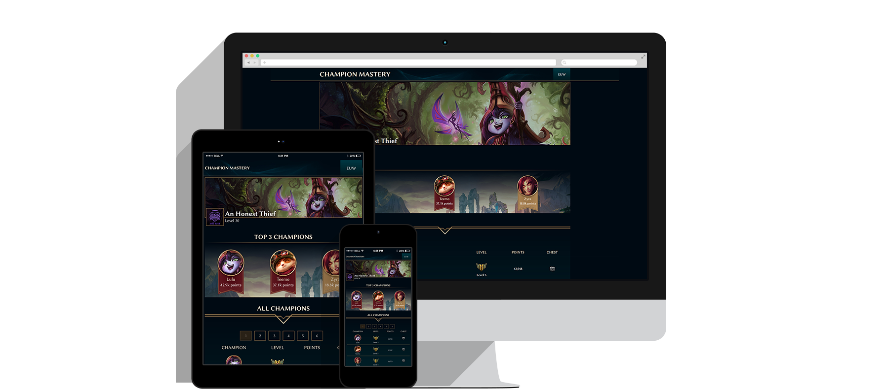

LeagueChampionMastery ([Demo](http://championmastery.net16.net/))
=====================

Overview
--------

A champion mastery lookup for EUW, EUNE and NA. I picked these three regions because they are predominantly English speaking, at least in terms of League sites, and since I'm at Uni at the moment I don't have time to add localisation as well!

The design of the website is Hextech-y, to fit in with recent / upcoming League changes. It's responsive!

Tested on the following resolutions:
* 2560 x 1440
* 1920 x 1080
* 1280 x 720
* 800 x 600
* 320 x 480
 
Once a user searches for a Summoner, two API calls are made. The first call matches the user-inputted Summoner name to an id. The second call uses that id to fetch a list of champions and champion mastery details. From this second call, the id is matched with a local JSON array to find the names and keys of each champion.

All the relevant data is stored in a session so that it can then be displayed to the user. The session is destroyed once the data has been displayed. 

For a more scalable solution I would've gone with a MYSQL database, both to limit API calls and to prevent session buildup. However, for low traffic (and for the purposes of the competition given the balancing of coursework and this project) sessions are a good way to pass data from one php file to another.

The data displayed on the summoner page:

* User header : a slice of splash art from one of the user's top 3 champions.
* Username, level, profile picture.
* Top 3 champions, with icon, name, points displayed. The level is also displayed in the form of a background image banner.
* A table of all the champions the user has mastery points for. Displays:
Name, mastery level, points, whether the user has been granted a chest with that champion. The table is displayed in descending order of points, with jQuery pagination.

**Ideas for the future**
* MYSQL database instead of sessions
* Progress bar displaying how far the user has to go to unlock the next mastery level for a specific champion

To run this on your machine:
----------------------------
**Requirements:**
* You will need a local server environment, as this runs on PHP. I personally use MAMP, although there are alternatives such as XAMPP.
* "allow_url_fopen" should be enabled in your php.ini file. This is enabled by default in MAMP, and is needed to get the contents of URLs (aka API queries).

* You will need a Riot API key. See the  for more details.

Once you have the files copied to your local server environment (in MAMP, this is a folder called htdocs), **you will have to copy your API key into "config.php"** on the line which should be marked as follows:

    // define the API key
    define('API_KEY', "key goes here");
